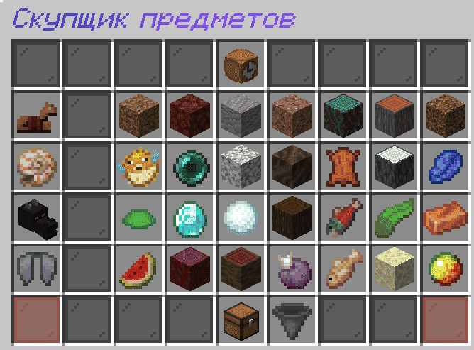
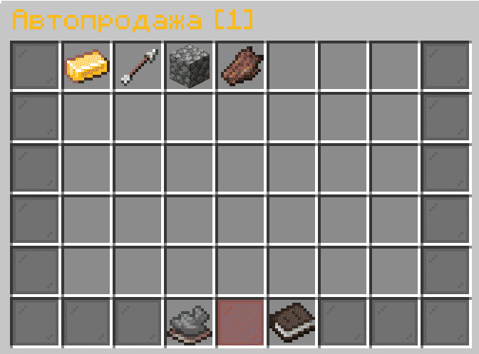

# PrimeSeller-Fork

**Fork maintained by [flyawaymaking](https://github.com/flyawaymaking)**  
*Original plugin by [destroydevs](https://github.com/destroydevs/primeseller)*

[](https://opensource.org/licenses/Apache-2.0)

## About

A powerful and customizable Minecraft plugin for Paper servers (1.21.4+) that allows players to sell items to a buyer for
in-game currency. Features both a manual seller interface and a fully automated auto-sell system.

## Features

* **Interactive Seller GUI:** Open a configurable menu (`/seller`) to sell items individually, in stacks, or your entire
  inventory.
* **Smart Auto-Seller:** Automatically sells specific items from your inventory on a configurable timer. Manage your
  auto-sell list via a dedicated GUI (`/autoseller`).
* **Dual Economy Support:** Seamlessly integrates with **Vault** or **CoinsEngine** for handling transactions.
* **Dynamic Pricing:** Items can be categorized as **Limited** (with per-player daily limits) or **Unlimited**. Prices
  for unlimited items can gradually decrease based on server sales to simulate market saturation.
* **Multi-language Material Names:** Automatically fetches and uses correct item names in the player's configured
  language.
* **PlaceholderAPI Support:** Provides placeholders for auto-sell status, update timers, and sold item counts.
* **Fully Configurable:** Extensive configuration files for messages, menus, items, prices, permissions, and economy
  settings.
* **Scheduled Updates:** Limited and Unlimited item stocks and prices refresh on customizable timers.

## Commands

| Command                                 | Description                                                       | Permission               | Default |
|:----------------------------------------|:------------------------------------------------------------------|:-------------------------|:--------|
| `/seller`                               | Opens the main selling interface.                                 | `primeseller.seller`     | true    |
| `/autoseller`                           | Opens the auto-seller management GUI.                             | `primeseller.autoseller` | true    |
| `/autoseller on/off/toggle`             | Toggles the auto-sell function on or off.                         | `primeseller.autoseller` | true    |
| `/primeseller reload`                   | Reloads all plugin configuration files.                           | `primeseller.admin`      | OP      |
| `/primeseller update`                   | Manually triggers an update for both Limited and Unlimited items. | `primeseller.admin`      | OP      |
| `/primeseller update limited`           | Manually updates only Limited items.                              | `primeseller.admin`      | OP      |
| `/primeseller update unlimited`         | Manually updates only Unlimited items.                            | `primeseller.admin`      | OP      |
| `/primeseller addlimited <min> <max>`   | Adds the held item to the Limited item pool.                      | `primeseller.admin`      | OP      |
| `/primeseller addunlimited <min> <max>` | Adds the held item to the Unlimited item pool.                    | `primeseller.admin`      | OP      |

## Permissions

* `primeseller.seller` - Allows use of `/seller`.
* `primeseller.autoseller` - Allows use of `/autoseller` and basic auto-sell functionality.
* `primeseller.user` - Gives permissions `primeseller.seller` and `primeseller.autoseller`
* `primeseller.autoseller.<number>` - Grants a specific number of slots in the auto-seller (e.g.,
  `primeseller.autoseller.10`).
* `primeseller.autoseller.bypass` - Bypasses the auto-seller slot limit.
* `primeseller.admin` - Grants access to all admin commands (`/primeseller ...`).

## Placeholders (PlaceholderAPI)

If PlaceholderAPI is installed, the following placeholders are available:

* `%primeseller_autoseller_status%` - Returns the player's auto-sell status (e.g., "enabled" / "disabled").
* `%primeseller_sold_items_number%` - Returns how many limited items the player has sold in the current period.
* `%primeseller_limited_time%` - Time until the next Limited item update (raw format).
* `%primeseller_limited_time_formatted%` - Formatted time until the next Limited item update.
* `%primeseller_unlimited_time%` - Time until the next Unlimited item update (raw format).
* `%primeseller_unlimited_time_formatted%` - Formatted time until the next Unlimited item update.

## Adding Sellable Items

Admins can add items directly in-game:

1. Hold the item you want to add.
2. Run `/primeseller addlimited <minPrice> <maxPrice>` for Limited items.
3. Run `/primeseller addunlimited <minPrice> <maxPrice>` for Unlimited items.

The plugin will generate a random price between min and max for the item each time the stock refreshes.



## Auto-Seller Guide

1. A player with the `primeseller.autoseller` permission uses `/autoseller`.
2. In the opened GUI, they can click items from their **lower inventory** to add them to the auto-sell list.
3. They can click items in the **upper GUI** to remove them from the list.
4. Use the toggle button to turn auto-selling **On** or **Off**.
5. The plugin will automatically sell items from the player's inventory that are on their list, at the interval set in
   `config.yml`.

**Slot Limits:** Players start with 0 auto-sell slots. Grant slots using permissions: `primeseller.autoseller.5`,
`primeseller.autoseller.20`, etc. The highest value permission applies.



## Installation

1. Ensure your server is running **Paper 1.21.4 or later**.
2. Install the required dependencies:
    * **[Vault](https://www.spigotmc.org/resources/vault.34315/)** (or
      ensure [CoinsEngine](https://github.com/nulli0n/CoinsEngine-spigot) is installed if using that economy).
    * (Optional) **[PlaceholderAPI](https://github.com/PlaceholderAPI/PlaceholderAPI)** for placeholder support.
3. Download the latest `PrimeSeller-Fork.jar` from the [Releases](../../releases) page.
4. Place the JAR file into your server's `plugins` folder.
5. Restart your server.
6. Configure the `plugins/PrimeSeller-Fork/config.yml` and other files to your liking.
7. Use `/primeseller reload` to apply changes.

## Configuration

After the first run, the plugin will generate several configuration files in `plugins/PrimeSeller-Fork/`:

* `config.yml` - Main settings: language, economy, auto-sell interval, price reduction mechanics.
* `messages.yml` - All plugin messages, customizable with MiniMessage format.
* `menu.yml` - Contains `seller-menu` and `autoseller-menu` for fully customizing the look, layout, and items in both
  GUIs.
* `items.yml` - Define which items are in the Limited/Unlimited pools, their min/max prices, and global limits.
* `translations/` - Automatically generated files with localized material names.

### Economy Setup

By default, the plugin uses **Vault**. Ensure you have a Vault-compatible economy plugin (like EssentialsX) installed.

To use **CoinsEngine**, set the following in `config.yml`:

```yml
economy:
  coins-engine:
    enable: true
    currency: "money" # Your CoinsEngine currency name
```

## Support

Please report issues, bugs, or feature requests on the [GitHub Issues](../../issues) page.

## Credits

* **Original Author:** [destroydevs](https://github.com/destroydevs/primeseller)
* **Fork Maintainer & Developer:** [flyawaymaking](https://github.com/flyawaymaking)
* **License:** Apache License 2.0

